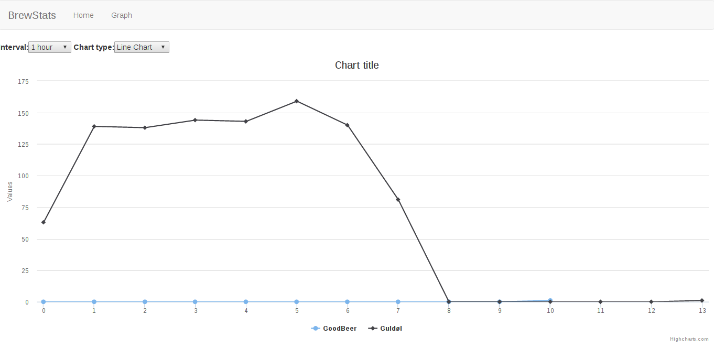
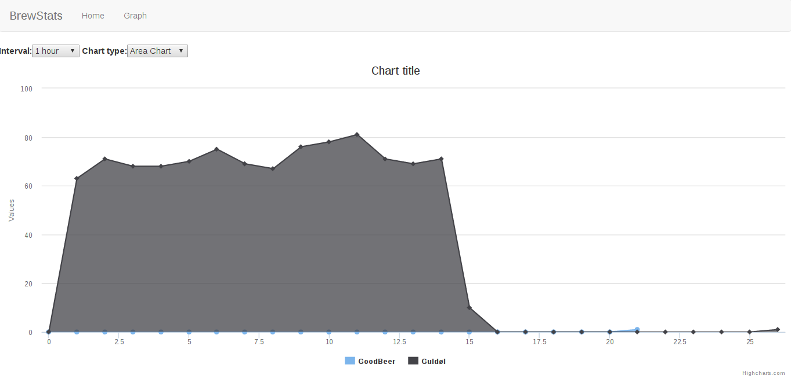
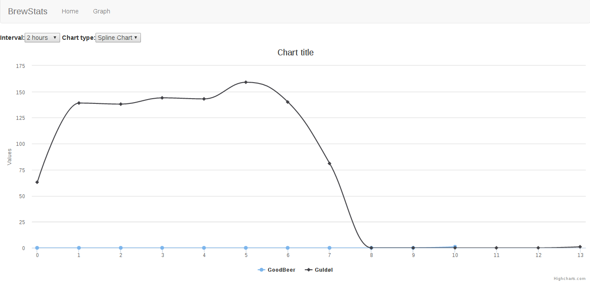

# beersite

### How to

- Install dependencies `pip install -r requirements.txt`
- Run server `python manage.py runserver`
- Migrate `python manage.py migrate`
- GPIO `python manage.py bubbletrack`

